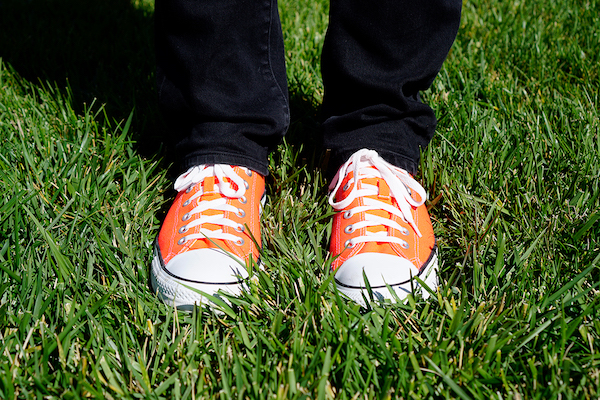

## Моделирование изменений условий освещения в видеопотоке, построение и сравнение интеграторов кадров видеопотока

__Integrators task for MIPT Image Processing Course__

##### [Отчет в Google Docs](https://docs.google.com/document/d/19doET2-EQ5ixrpWKwJ9cy77sKiUrJ5n54D0eBZK04zs/edit?usp=sharing) | [Данные прогона на Google Drive](https://drive.google.com/drive/folders/1l6ugKov33MBbG_s0v77CIQxPfEG4Bvrc?usp=sharing)

### Исходное изображение

### Модель изображения

| среднее l2 расстояние до исходного / % случаев сходимости  | простой усредняющий интегратор | усредняющий интегратор с простой нормализацией тек. кадра | усредняющий интегратор с взвешенной нормализацией тек. кадра |
| :-------------------: | :-----------------------: | :-----------------------------------: | :--------: |
| случайные яркостные изменения вне зависимости от простр. координат |  |  |  |
| случайные яркостные изменения с зависимостью от простр. координат |  |  |  |
| случайные яркостные изменения с зависимостью от простр. координат, случайные цветовые изменения вне зависимости от простр. координат |  |  |  |